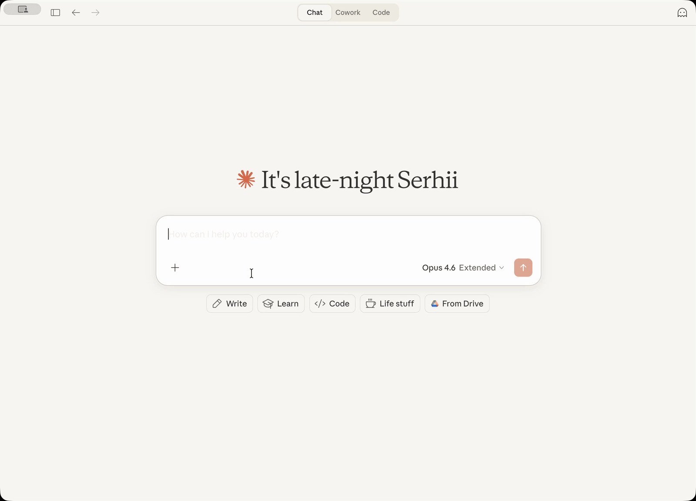
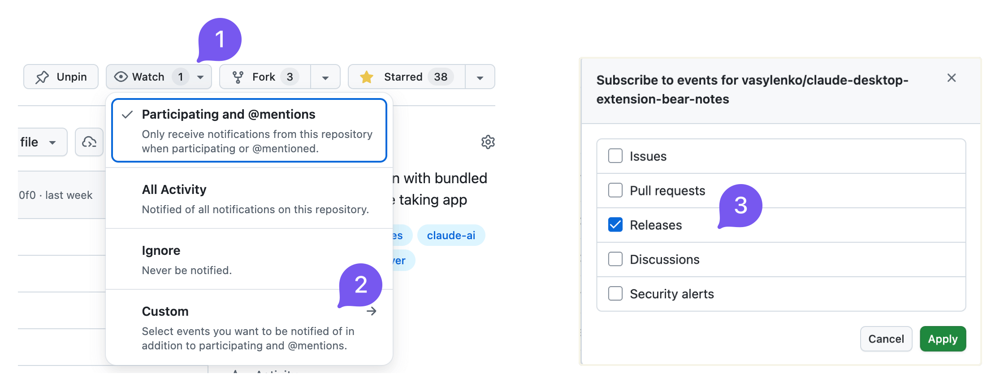

[](https://github.com/vasylenko/bear-notes-mcp/actions/workflows/ci.yml)
[](https://deepwiki.com/vasylenko/bear-notes-mcp)
[](https://glama.ai/mcp/servers/vasylenko/bear-notes-mcp)

[](https://buymeacoffee.com/vasylenko)

# Bear Notes MCP Server

An unofficial, opinionated MCP server for Bear Notes — built around relevance-ranked search instead of substring matching. Results come ranked across titles, bodies, and hierarchical tags, with snippets and combinable filters (tag, date, pinned). Reads run direct against Bear's SQLite database — no Bear app required for queries.

Writes route through Bear's own URL handler — atomic and validated by Bear. Offline-first: no network calls, no telemetry, all processing on your Mac. Works with any MCP client — Claude Desktop, Claude Code, Codex, Gemini, Cursor. Ships as a one-click **.mcpb extension** or a standalone **npm package**.

Example prompts:

> Find the deep-dive I wrote on export pipelines, somewhere under #engineering/

> Append today's decisions to the 'Decisions' section of my Weekly Ops note

> Pull every note under #research/llm-evals into a survey outline

> Find my notes tagged #blog/drafts and draft this week's post outline



## ✨ Key Features

- **12 MCP tools** for searching, reading, creating, editing, tagging, and archiving notes
- **Relevance-ranked search** across titles, bodies, and tags — finds the right note, not just the ones that contained your literal words
- **Date-based search** with relative dates ("yesterday", "last week", "start of last month")
- **Hierarchical tag management** — view tags as a tree with note counts; rename or delete a tag across the whole library
- **Surgical writes** — append at a specific heading or attach files without rewriting the whole note
- **New note convention** (opt-in) — place tags right after the title instead of at the bottom
- **Content replacement** (opt-in) — replace the full note body or a specific section
- **Local-first** — direct read-only SQLite reads, native `node:sqlite`, no network calls, no telemetry

> [!NOTE]
> Complete privacy (except the data you send to your AI provider when using an AI assistant, of course): this server makes no external connections. All processing happens locally on your Mac using Bear's own database and API. There is no extra telemetry, usage statistics or anything like that.

## 👤 Who is this for

This is an unofficial, opinionated alternative to the native Bear MCP. It fits when:

- **You have years of notes and substring search isn't enough.** Search ranks results by relevance — titles, bodies, and tag matches across the whole library — so the right note rises to the top, even when your phrasing has drifted.

- **You bounce between MCP clients.** Stdio transport works with Claude Desktop, Claude Code, Codex CLI, Gemini, Cursor, Windsurf — anything that speaks MCP. No per-client glue code, no lock-in.

- **You want to query without pulling Bear forward.** Reads run straight against Bear's SQLite database. No need to keep Bear open — or even running — for a quick lookup mid-conversation. (Writes still route through Bear, atomically.)

- **You manage tags across the whole library.** Rename or delete a tag everywhere it appears, atomically. Hierarchical tag matching in search rolls up subtags automatically — work that's tedious through Bear's UI alone.

- **You care about supply-chain hygiene.** Native `node:sqlite` — no unsigned third-party binaries, no Gatekeeper hassles. Network-free server: no remote-fetch tools, no prompt-injection surface.

If you have a small library and just want a quick notes integration, you may not need this yet.

## 📦 Installation

### Claude Desktop Extension

**Prerequisites**: [Bear app](https://bear.app/) must be installed and [Claude Desktop](https://claude.ai/download) must be installed.

1. Download the latest `bear-notes-mcpb-*.mcpb` extension file from [Releases](https://github.com/vasylenko/bear-notes-mcp/releases)
2. Make sure your Claude Desktop is running (start if not)
3. Doubleclick on the extension file – Claude Desktop should show you the installation prompt

    If doubleclick does not work for some reason, then open Claude -> Settings -> Extensions -> Advanced Settings -> click "Install Extension".

4. DONE!

Ask Claude to search your Bear notes with a query like "Search my Bear notes for 'meeting'" - you should see your notes appear in the response!

### Standalone MCP Server

Want to use this Bear Notes MCP server with Claude Code, Cursor, Codex, or other AI assistants?

**Requirements**: Node.js 24.13.0+

#### Claude Code (one command)

```bash
claude mcp add bear-notes --transport stdio -- npx -y bear-notes-mcp@latest
```

#### Other AI Assistants

Add to your MCP configuration file:
```json
{
  "mcpServers": {
    "bear-notes": {
      "command": "npx",
      "args": ["-y", "bear-notes-mcp@latest"]
    }
  }
}
```

**More installation options and local development setup — [NPM.md](./docs/user/NPM.md)**

## 🛠️ Tools

<!-- TOOLS:START -->
- **`bear-open-note`** - Read the full text content of a Bear note including OCR'd text from attached images and PDFs
- **`bear-create-note`** - Create a new note in your Bear library with optional title, content, and tags
- **`bear-search-notes`** - Find notes by relevance across titles, body, and OCR-extracted text from attached images and PDFs. Use a phrase or a few keywords describing what you're looking for; results are ranked by relevance and each includes a context snippet. Also supports tag, date-range, and pinned-only filters — combine with a search term or use them on their own to browse.
- **`bear-add-text`** - Insert text at the beginning or end of a Bear note, or within a specific section identified by its header
- **`bear-replace-text`** - Replace content in an existing Bear note — either the full body or a specific section. Requires content replacement to be enabled in settings.
- **`bear-add-file`** - Attach a local file (image, PDF, document) to an existing Bear note. Bear extracts text from images and PDFs via OCR, making attachment content searchable.
- **`bear-list-tags`** - List all tags in your Bear library as a hierarchical tree with note counts
- **`bear-find-untagged-notes`** - Find notes in your Bear library that have no tags assigned
- **`bear-add-tag`** - Add one or more tags to an existing Bear note
- **`bear-archive-note`** - Archive a Bear note to remove it from active lists without deleting it
- **`bear-rename-tag`** - Rename a tag across all notes in your Bear library
- **`bear-delete-tag`** - Delete a tag from all notes in your Bear library without affecting the notes
<!-- TOOLS:END -->

## ⚙️ Configuration

### Debug Logging

Enable verbose logging for troubleshooting.

- **Claude Desktop**: Settings → Extensions → Configure (next to Bear Notes) → toggle "Debug Logging" → Save → Restart Claude
- **Standalone MCP server**: set environment variable `UI_DEBUG_TOGGLE=true`

### New Note Convention

By default, Bear places tags at the bottom of a note when created via API. Enable this option to place tags right after the title instead, separated by a horizontal rule.

<details>
<summary>See note structure with this convention enabled</summary>

```
┌──────────────────────────────┐
│ # Meeting Notes              │  ← Note title
│ #work #meetings              │  ← Tags right after title
│                              │
│ ---                          │  ← Separator
│                              │
│ Lorem Ipsum...               │  ← Note body
└──────────────────────────────┘
```

</details>

> [!TIP]
> This convention is **disabled by default** — it's opt-in so existing behavior is preserved.

- **Claude Desktop**: Settings → Extensions → Configure (next to Bear Notes) → toggle "New Note Convention" → Save → Restart Claude
- **Standalone MCP server**: set environment variable `UI_ENABLE_NEW_NOTE_CONVENTION=true`

Example standalone configuration with the convention enabled:
```json
{
  "mcpServers": {
    "bear-notes": {
      "command": "npx",
      "args": ["-y", "bear-notes-mcp@latest"],
      "env": {
        "UI_ENABLE_NEW_NOTE_CONVENTION": "true"
      }
    }
  }
}
```

### Content Replacement

Enable the `bear-replace-text` tool to replace content in existing notes — either the full note body or a specific section under a header.

> [!TIP]
> This feature is **disabled by default** — it's opt-in because replacement is a destructive operation.

- **Claude Desktop**: Settings → Extensions → Configure (next to Bear Notes) → toggle "Content Replacement" → Save → Restart Claude
- **Standalone MCP server**: set environment variable `UI_ENABLE_CONTENT_REPLACEMENT=true`

Example standalone configuration with content replacement enabled:
```json
{
  "mcpServers": {
    "bear-notes": {
      "command": "npx",
      "args": ["-y", "bear-notes-mcp@latest"],
      "env": {
        "UI_ENABLE_CONTENT_REPLACEMENT": "true"
      }
    }
  }
}
```

## Technical Details

This server reads your Bear Notes SQLite database directly for search/read operations and uses Bear's X-callback-URL API for write operations. All data processing happens locally on your machine with no external network calls.

### Platforms Supported
macOS only because Bear desktop works only on macOS.

### Logs

**Claude Desktop:**
- MCP server logs go into `~/Library/Logs/Claude/main.log`, look for `bear-notes-mcp`
- MCP transport logs go to `~/Library/Logs/Claude/mcp-server-Bear\ Notes.log`

**Standalone MCP server:**
- Logs are written to stderr; enable debug logging with `UI_DEBUG_TOGGLE=true`

## FAQ

### Could this steal my data?
**No**. The server only reads Bear's local database (same data Bear app shows you) and uses Bear's native API to add text to the notes. No network transmission, no external servers.

### Why SQLite and not just a native Bear app's x-callback-url API?

For read operations (search/open), the x-callback-url API returns the note data in `x-success` response: that would require a server or custom binary to handle x-success responses - both risky and fragile. Direct SQLite read-only access is simpler and more reliable for searching and reading notes.

### Why native Node.js SQLite instead of third-party packages?

This avoids shipping an SQLite binary from third-party node packages, which poses supply chain risks and blocks the Claude Desktop extension from running on macOS.

Anthropic does not sign third-party SQLite binaries (obviously), causing macOS security systems to flag that the Claude process from a binary signed by Anthropic is trying to run another binary signed by a third party. As a result, Claude Desktop cannot run the extension.

### When I install the extension, I see a red warning: "Installing will grant access to everything on your computer." - what does this mean?

This is how Claude for Desktop reacts to the fact that this extension needs access to the Bear SQLite database on your Mac.

Claude warning system does not distinguish between the need to access only one file (what the extension does) versus the need to access all files (this is NOT what the extension does).

One of the ways to validate this is asking your Claude to analyze the codebase (it is pretty small) before installing the extension and tell you.

### How can I report a bug or contribute?

Use issues or discussions! I'd be glad to see your feedback or suggestions, or your help to make this project better! ❤️

## Staying Up To Date

Consider subscribing to release announcements to know when a new version is released:



I also post to [reddit.com/r/bearapp/](https://www.reddit.com/r/bearapp/) when there's a new release.
