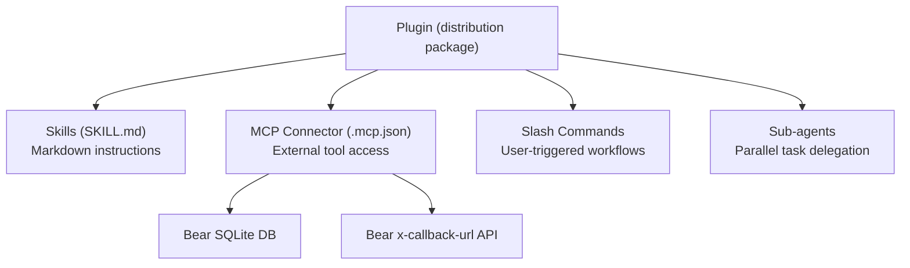

# Bear Notes MCP to Claude Plugin: Research Findings and Conversion Plan

## Terminology Demystified

There are three distinct layers in the Claude ecosystem, and they are **not interchangeable**:

- **MCP (Model Context Protocol)** -- The underlying open protocol/plumbing. Still very much alive and central. Anthropic has NOT moved away from it; they've built higher-level abstractions on top of it.
- **Skills** -- Markdown files (`SKILL.md`) with instructions that Claude dynamically loads. **No runtime code execution for external system access.** Think of them as reusable prompt templates. They cannot read databases, call APIs, or interact with local apps.
- **Connectors** -- MCP-powered connections to external tools and data. This is the user-facing term for what an MCP server provides. Bear Notes MCP is a connector.
- **Plugins** -- The distribution unit that bundles **all of the above** together: skills + MCP connectors + slash commands + sub-agents. Plugins work in both **Claude Code** and **Cowork**.



## What bear-notes-mcp Currently Is

The bear-notes-mcp codebase is an **MCP server** (a connector) distributed two ways:

- As an **MCPB** (MCP Bundle / `.mcpb`) for Claude Desktop one-click install
- As an **npm package** for Claude Code, Cursor, Codex, etc.

It provides 12 MCP tools that read Bear's SQLite database directly (for search/read) and use Bear's x-callback-url API (for writes). This requires **runtime code execution** — Node.js reading a local SQLite file, executing URL schemes on macOS.

## Why It CANNOT Be "Just a Skill"

A skill is a markdown file with instructions. It has no ability to:

- Open and query a SQLite database
- Execute x-callback-url commands
- Interact with local filesystem paths
- Run any code against external systems

If you tried to make bear-notes-mcp a pure skill, Claude would **hallucinate** note content rather than reading real data. Skills are for teaching Claude *how* to do something, not for giving Claude *access* to something.

## What It SHOULD Become: A Plugin

A **plugin** is the correct target. It bundles the MCP connector (the current server code) with skills, slash commands, and sub-agents into a single installable package that works in **both Claude Code and Cowork**.

### Current Project Structure

```
bear-notes-mcp/
├── src/main.ts              # MCP server entry point (12 tools)
├── src/database.ts          # SQLite database connection
├── src/notes.ts             # Note operations (search, content)
├── src/tags.ts              # Tag operations (list, hierarchy)
├── src/bear-urls.ts         # Bear x-callback-url handlers
├── manifest.json            # MCPB manifest (Claude Desktop extension)
├── package.json             # npm package config
└── .mcp.json                # Local dev MCP config
```

### Target Plugin Structure

```
bear-notes-plugin/
├── .claude-plugin/
│   └── plugin.json          # Plugin manifest (name, version, author, userConfig)
├── skills/
│   └── bear-notes/
│       └── SKILL.md         # Instructions for how to use Bear Notes effectively
├── commands/
│   ├── search.md            # /bear-notes:search slash command
│   ├── create.md            # /bear-notes:create slash command
│   └── organize.md          # /bear-notes:organize slash command
├── agents/
│   └── note-curator.md      # Sub-agent for complex note management workflows
├── .mcp.json                # MCP server config (points to npm package)
├── README.md
└── CHANGELOG.md
```

### Key Files to Create

**`.claude-plugin/plugin.json`** -- Plugin manifest with `userConfig` for debug logging, note conventions, and content replacement toggles (mirroring the current MCPB `user_config`).

**`.mcp.json`** -- Bundles the existing MCP server via npm:

```json
{
  "mcpServers": {
    "bear-notes": {
      "command": "npx",
      "args": ["-y", "bear-notes-mcp@latest"],
      "env": {
        "UI_DEBUG_TOGGLE": "${user_config.debug}",
        "UI_ENABLE_NEW_NOTE_CONVENTION": "${user_config.enable_new_note_convention}",
        "UI_ENABLE_CONTENT_REPLACEMENT": "${user_config.enable_content_replacement}"
      }
    }
  }
}
```

**`skills/bear-notes/SKILL.md`** -- Teaching Claude best practices for working with Bear Notes: when to search vs. open by title, how to structure notes with headers for section-level operations, tag hierarchy conventions, etc.

**`commands/`** -- Slash commands like `/bear-notes:search`, `/bear-notes:create`, `/bear-notes:organize` that provide structured workflows.

**`agents/note-curator.md`** -- A sub-agent that can handle multi-step note organization workflows in parallel (e.g., "organize all untagged notes" or "merge duplicate notes").

## Platform Compatibility

| Platform        | Plugin Support           | How It Works                                        |
| --------------- | ------------------------ | --------------------------------------------------- |
| Claude Code     | Full support             | Install via marketplace or `--plugin-dir`           |
| Claude Cowork   | Full support             | Plugins extend agentic multi-step workflows         |
| Claude Desktop  | Via MCPB only            | Keep existing `.mcpb` distribution alongside plugin |
| Claude.ai (web) | Via Connectors Directory | Submit MCP server as a remote connector             |

## Existing Reference: The `zen` Plugin

The [dailyzen-skill](https://github.com/kropdx/dailyzen-skill) plugin follows the correct plugin structure with `.claude-plugin/plugin.json`, `skills/zen/SKILL.md`, and `scripts/`. The bear-notes plugin would follow the same pattern but add an `.mcp.json` for the connector.

## Implementation Approach

The MCP server code (`bear-notes-mcp` npm package) stays as-is — it's already well-built. The plugin is a **wrapper** that bundles the MCP server with skills, commands, and agents. This means:

- No changes to the existing MCP server codebase
- The plugin references the npm package via `.mcp.json`
- Skills, commands, and agents are new markdown files layered on top
- Both distribution channels (MCPB for Desktop, Plugin for Code/Cowork) can coexist

## Summary

| Question                        | Answer                                                                             |
| ------------------------------- | ---------------------------------------------------------------------------------- |
| Is bear-notes-mcp a skill?      | No. It is a connector (MCP server).                                                |
| Can it become "just a skill"?   | No. Skills cannot access databases or local APIs.                                  |
| Does it need to be a connector? | Yes. The MCP server is the connector layer.                                        |
| What should it become?          | A **plugin** that bundles the connector + skills + commands + agents.               |
| Does MCP go away?               | No. MCP is the foundation. Connectors, plugins, and skills are built on top of it. |
